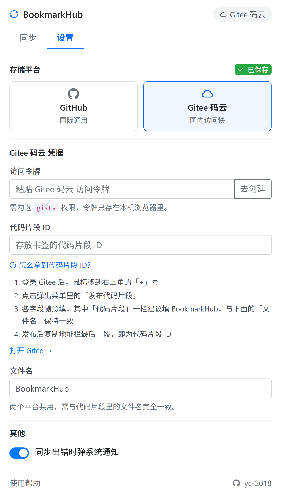

<!-- PROJECT LOGO -->
<br />
<p align="center">
  <a href="https://github.com/yc-2018/BookmarkHub">
    
  </a>

  <h1 align="center">Bookmarks 2 Hub</h1>
  <p align="center">
    书签备份到 Git 仓库。在 Chrome、Edge、Firefox 之间同步书签，数据只存在你自己的 GitHub Gist 或 Gitee 代码片段里。
    <br />
    <small>基于 <a href="https://github.com/dudor/BookmarkHub">dudor/BookmarkHub</a> 二次开发</small>
    <br />
    <a href="https://github.com/yc-2018/BookmarkHub/releases">下载</a>
    ·
    <a href="https://github.com/yc-2018/BookmarkHub/issues">反馈问题</a>
    ·
    <a href="/README.md">English</a>
  </p>
</p>

## 这是什么

一个浏览器扩展。点一下把本地书签上传到远端，换台电脑或换个浏览器再点一下下载回来。没有自己的服务器，也不需要注册账号 —— 书签以一个 JSON 文件的形式放在你自己的 GitHub Gist 或 Gitee 代码片段里。

<p align="center">
  
  &nbsp;&nbsp;
  
</p>

## 特点

- **支持 Gitee 码云**：访问 GitHub 不稳定时可以改用码云。两个平台的凭据各自保存，随时切换，互不覆盖
- **对比后再决定**：拉取远端与本地比对，按「仅本地有 / 仅远端有 / 位置变化 / 标题变化 / 排列顺序变化 / 文件夹差异」分组列出，看清楚再选上传还是下载
- **每一步都有确认**：上传、下载、清空都会先弹出确认框并写明后果，不会悄悄覆盖你的书签
- **全中文界面**，设置就在弹窗里，首次打开直接进入配置
- 显示本地与远端书签数量；本地有未同步改动时图标上会出现 `!` 角标

## 安装

发行包在 [GitHub Releases](https://github.com/yc-2018/BookmarkHub/releases)，每个版本有三个文件：

| 文件 | 用途 |
|---|---|
| `bookmarkhub-<版本>-chrome.zip` | Chrome、Edge 及其他 Chromium 内核浏览器 |
| `bookmarkhub-<版本>-firefox.zip` | Firefox |
| `bookmarkhub-<版本>-sources.zip` | 源码包，仅供 Firefox 审核用，普通用户不用下 |

**Chrome / Edge**：解压 chrome 包 → 打开 `chrome://extensions`（Edge 是 `edge://extensions`）→ 右上角打开「开发者模式」→「加载已解压的扩展程序」→ 选中解压出来的目录。

**Firefox**：打开 `about:debugging#/runtime/this-firefox` →「临时载入附加组件」→ 选中 firefox 包。这是临时安装，重启浏览器后需要重新载入。

> 各应用商店里上架的 BookmarkHub 是原作者 dudor 的上游版本，**不包含**本项目的改动（Gitee、对比、中文界面等）。

## 使用

### 第一步：准备一个存放书签的地方

二选一即可，也可以两个都配好随时切换。

**GitHub**

1. [创建访问令牌](https://github.com/settings/tokens/new?scopes=gist&description=BookmarkHub)，权限勾选 `gist`
2. 打开 [GitHub Gist](https://gist.github.com)，新建一个 **Secret** gist：「Filename including extension」填 `BookmarkHub`，代码内容区随便敲一个字符（不能留空）
3. 创建后复制地址栏最后一段，那就是代码片段 ID

> 请用 Secret gist。公开 gist 会被他人搜索到，你的书签也就公开了。

**Gitee 码云**

1. [创建私人令牌](https://gitee.com/profile/personal_access_tokens/new)，权限勾选 `gists`
2. 登录后把鼠标移到右上角的「+」号，点「发布代码片段」。各字段随意填，其中「代码片段」一栏建议填 `BookmarkHub`
3. 发布后复制地址栏最后一段，那就是代码片段 ID

### 第二步：填入扩展

点击工具栏图标。首次打开会直接进入「设置」：选择平台 → 粘贴令牌 → 填代码片段 ID → 文件名保持 `BookmarkHub`。修改会自动保存。

### 第三步：同步

切到「同步」标签页：

- **上传书签**：用本地书签覆盖远端
- **下载书签**：先清空本地，再用远端书签重建
- **对比本地与远端**：先看差异，再在对比页里选择上传还是下载

图标角标：`!` 本地有未同步改动，`✓` 已同步，`↻` 进行中，`✗` 出错。出错时弹窗内会显示平台返回的原因（例如令牌无效）。

## 为什么没有自动同步

早期版本曾有「检测到改动就自动同步」，已经移除。浏览器扩展的后台进程空闲几十秒就会被终止，定时器随之失效，那套机制实际上并不可靠；而且后台悄悄整树覆盖，一旦判断错方向就会丢书签。现在所有同步都由你主动触发并确认。

## 已知限制

- 同步是**整树覆盖**，不做逐条合并。两边都改过时，先用「对比」看清差异再决定方向
- Gitee 服务端不接受 emoji 字符。扩展会在上传前自动转义、下载时原样还原，书签标题里的 emoji 不会丢，只是在 Gitee 网页上看到的是转义后的形式

## 开发

```bash
pnpm install          # 安装依赖
pnpm run dev          # Chrome 开发模式
pnpm run build        # 构建到 .output/chrome-mv3/
pnpm run zip          # 打包
```

技术栈 WXT + React + TypeScript。架构说明、发版流程和各种踩过的坑见 [CLAUDE.md](CLAUDE.md)。

## 许可与致谢

本项目基于 [dudor/BookmarkHub](https://github.com/dudor/BookmarkHub) 修改而来，感谢原作者。许可证见 [LICENSE](LICENSE)，署名信息见 [NOTICE.txt](NOTICE.txt)。
